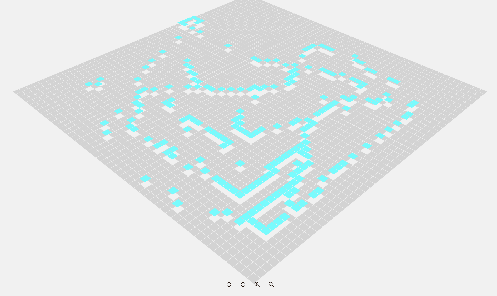

# Map explorer

This repo is a very simple project that plays around with CSS transformations and animations.

The main goal was to get some experience with [Parcel](https://parceljs.org/) bundler. Code is written in [TypeScript](https://www.typescriptlang.org/), CSS with [SASS](https://sass-lang.com/) and bundled all together with [Parcel](https://parceljs.org/). Configuration is really minimal, just a TS configuration file 👏👏👏👏.

The page creates a 2500 `div` elements in a CSS Grid. It then transforms a few CSS properties with mouse click events on those elements. Zooming in/out (mouse wheel, buttons or ⬇️/⬆️ keyboard arrows) and rotating (button or ⬅️/➡️ keyboard arrows) are possible. Browser does not perform well with it.

On the positive side, my two nephews love playing with it.
